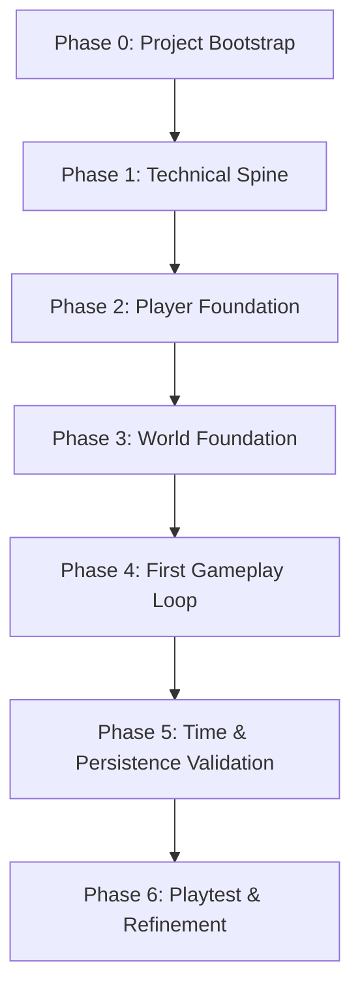

# Underhallow Implementation Architecture Specification V1

**Document ID:** IA-001  
**Version:** V1.1  
**Status:** REVIEW  
**Authority Level:** Level 4 — Implementation Specification  
**Parent Specifications:**
* [North Star V1.0 (NS-001)](../01-product/NORTH_STAR.md)
* [Foundation Specification V1.0 (FS-001)](../01-product/FOUNDATION_SPECIFICATION.md)
* [Engine & Technical Architecture Specification V1 (ETA-001)](ENGINE_TECHNICAL_ARCHITECTURE_SPECIFICATION.md)
* [Core Gameplay Systems Specification V1.0 (CG-001)](../03-gameplay/CORE_GAMEPLAY_SYSTEMS_SPECIFICATION.md)
* [Player Control, Movement & Interaction Specification V1.0 (PC-001)](../03-gameplay/PLAYER_CONTROL_MOVEMENT_INTERACTION_SPECIFICATION.md)
* [World & Map Architecture Specification V1.0 (WM-001)](../04-world/WORLD_MAP_ARCHITECTURE_SPECIFICATION.md)
* [Player Progression Specification V1.0 (PR-001)](../03-gameplay/PLAYER_PROGRESSION_SPECIFICATION.md)
* [Farming System Specification V1.0 (FB-001)](../03-gameplay/FARMING_SYSTEM_SPECIFICATION.md)
* [Hunting & Combat System Specification V1.0 (HU-001)](../03-gameplay/HUNTING_COMBAT_SYSTEM_SPECIFICATION.md)
* [Multiplayer & Social Systems Specification V1.0 (MS-001)](../07-multiplayer/MULTIPLAYER_SOCIAL_SYSTEMS_SPECIFICATION.md)

**Engine:** Godot  
**Language:** GDScript  
**Primary Platform:** Windows PC  
**Architecture:** Single-player-first, multiplayer-native  
**Implementation Philosophy:** Specify enough → prototype → learn → refine → lock → build  

---

## 1. Purpose

This specification defines the minimum technical implementation architecture required to begin building Underhallow.

It establishes:

* architectural decision classification (rules vs. prototype defaults vs. open decisions)
* project structure and domain ownership
* gameplay-system boundaries
* scene architecture and modular runtime composition
* data architecture and content definitions
* global service evaluation criteria
* input architecture
* world implementation
* camera architecture
* simulation time
* persistence abstraction and versioning
* networking boundaries and dedicated server preparation
* testing expectations
* AI-agent development boundaries and domain whitelisting
* asset organization
* explicit V0.1 implementation dependency sequence
* first implementation milestone (**Vertical Slice V0.1 — The First Day**)

This document does **not** replace the higher-level gameplay specifications.

Where this document conflicts with a higher-authority specification (`NS-001`, `FS-001`, `ETA-001`, or Level 2 system specifications), the higher-authority specification takes precedence and this document must be reconciled.

---

# 2. Decision Classification Framework

To ensure engineering agility during prototyping without eroding architectural integrity, every technical decision in this specification belongs to one of three tiers.

### 2.1 The Three Tiers

#### Tier A: ARCHITECTURAL RULE
A deliberate implementation constraint that must remain stable unless formally changed through architectural governance.
* Examples:
  * Game state is the authoritative truth; renderer is a representation.
  * State is strictly separated from presentation.
  * Explicit domain state ownership (no monolithic global state).
  * `Command → Validation → Mutation → Event` pattern for meaningful state changes.
  * Logical Input Map actions consumed by gameplay systems.
  * Dedicated `CameraController` separate from player controller.
  * Fixed isometric camera orientation with no player-controlled rotation in V1.
  * Continuous movement via `CharacterBody2D` with no stamina meter.
  * Simulation time governed by `GameTime`, not real-time delta accumulation.
  * Persistence abstraction layer with mandatory save versioning from day one.
  * Server-authoritative multiplayer direction (client is never authoritative over shared state).
  * Protected architecture-sensitive domains (`src/core/state/`, save schemas, networking contracts).

#### Tier B: PROTOTYPE DEFAULT
A recommended initial implementation choice for V0.1 that can be adjusted or refactored based on practical testing without requiring an architectural overhaul.
* Examples:
  * Local JSON save file serialization for the prototype.
  * Exact scene names and node hierarchies within runtime composition.
  * Exact internal subfolder subdivisions within `src/core/` and `src/gameplay/`.
  * Specific initial keybindings assigned to logical input actions.
  * Initial camera follow smoothing values and zoom increments.
  * Concrete implementation details of player animation state machines.
  * Specific Resource property schemas for prototype items and crops.

#### Tier C: OPEN IMPLEMENTATION DECISION
An implementation question intentionally left unresolved until empirical prototype evidence is gathered.
* Examples:
  * Final pixel-art base sprite resolution and display viewport scaling ratio.
  * Whether a candidate global service genuinely warrants an Autoload singleton.
  * Exact networking transport library and RPC serialization protocol for future multiplayer.
  * Optimal scene vs. tile entity granularity for world resource nodes.

### 2.2 Prototype vs. Lock Rule

> **Prototype Rule:**  
> 1. Prototype evidence may change a **Prototype Default** or resolve an **Open Decision**.  
> 2. Changing an **Architectural Rule** requires deliberate architectural review and specification reconciliation.  
> 3. Higher-level specifications (`NS-001`, `FS-001`, `ETA-001`, Level 2 specs) always remain authoritative over implementation details.  
> 4. AI agents must **never accidentally promote a Prototype Default or Open Decision into an immutable Architectural Rule**, nor treat a temporary prototype convenience as permanent architecture.

---

# 3. Core Architectural Principles

## 3.1 The game state is the truth `[ARCHITECTURAL RULE]`

The renderer is a representation of game state. Gameplay systems must never depend on visual nodes being the authoritative source of gameplay truth.

* An item exists because `InventoryState` contains its record.
* A crop is growing because `FarmingState` records its planted timestamp and growth stage.
* A creature is alive because `HuntingState` / world entity state tracks its health and position.
* A player owns a structure because ownership state registers their identifier.

Visual nodes (sprites, animations, particle effects, UI controls) represent state reactively. If all visual nodes are deleted and recreated from state, the game simulation must resume without data loss.

---

## 3.2 Domain ownership `[ARCHITECTURAL RULE]`

Underhallow uses multiple focused domain-state objects rather than a single monolithic mutable global object.

```text
GameState
├── PlayerState
├── WorldState
├── InventoryState
├── FarmingState
├── HuntingState
├── BuildingState
└── (Other Domain State)
```

Each state domain:
1. Owns the data required for its domain.
2. Exposes controlled mutation pathways.
3. Validates incoming requests against domain rules.
4. Emits domain signals/events when state updates.

---

## 3.3 Command → Validation → Mutation → Event `[ARCHITECTURAL RULE]`

Meaningful gameplay state mutations follow a structured flow:

```text
Input / Request
      ↓
Command
      ↓
Validation
      ↓
State Mutation
      ↓
Event / Signal
      ↓
Presentation / UI / Audio / Secondary Systems
```

* **Scope Clarification:** This pattern applies to **meaningful gameplay state mutations** (e.g., planting a seed, harvesting, spending an item, attacking a creature, placing a structure). Trivial internal operations (e.g., updating a temporary local calculation, internal cursor highlighting) do not require formal Command classes.
* **Benefits:**
  * Prevents UI, visual nodes, or arbitrary gameplay scripts from directly mutating state.
  * Provides a direct, proven path toward authoritative server validation for multiplayer without rewriting gameplay logic.
  * Makes state transitions deterministic, testable, and auditable.

---

## 3.4 Composition over deep inheritance `[ARCHITECTURAL RULE]`

Systems must prefer:
* Small, focused classes.
* Composition and node-based components.
* Explicit interfaces and duck typing where appropriate in GDScript.
* Signals for loose coupling.
* Data-driven definitions.

Deep inheritance hierarchies are prohibited unless explicitly justified by engine architecture.

---

## 3.5 Data-driven content `[ARCHITECTURAL RULE]`

Authored content definitions must be represented as data rather than hardcoded gameplay logic:

```text
ItemDefinition
CropDefinition
CreatureDefinition
BuildingDefinition
RecipeDefinition
```

Content evolves through data authoring without modifying core gameplay systems.

---

# 4. Project Structure

The project uses a hybrid structure combining domain-oriented code with Godot engine conventions.

### 4.1 Top-Level Organization `[ARCHITECTURAL RULE]`

```text
/
├── project.godot
│
├── src/
│   ├── core/
│   ├── gameplay/
│   ├── world/
│   ├── player/
│   ├── networking/
│   └── presentation/
│
├── assets/
│   ├── characters/
│   ├── environment/
│   ├── items/
│   ├── creatures/
│   ├── buildings/
│   ├── ui/
│   └── effects/
│
├── data/
│   ├── items/
│   ├── crops/
│   ├── creatures/
│   └── recipes/
│
├── scenes/
│   ├── game/
│   ├── world/
│   ├── player/
│   ├── ui/
│   └── entities/
│
├── tests/
│   ├── unit/
│   └── integration/
│
└── docs/
```

### 4.2 Subfolder Granularity `[PROTOTYPE DEFAULT]`

Internal subfolder organization within domains represents conceptual guidance, not mandatory empty directory scaffolding:

```text
src/core/
├── state/
├── commands/
├── events/
├── time/
├── persistence/
└── definitions/
```

* **Rule:** Subdirectories are created **only when active implementation requires them**. The architectural mandate is clear domain separation, not premature folder creation.

### 4.3 Architecture-Sensitive Protection `[ARCHITECTURAL RULE]`

`src/core/state/`, global save schemas, and persistence contracts are architecture-sensitive. Agents must not modify core state containers or global schemas without an approved Architecture Plan.

---

# 5. Gameplay Architecture

Gameplay systems are organized by domain under `src/gameplay/`:

```text
src/gameplay/
├── farming/
├── hunting/
├── inventory/
├── crafting/
├── building/
├── interaction/
└── progression/
```

* Domains are introduced progressively as prototype requirements demand.
* Each domain system:
  1. Owns its domain logic and rules.
  2. Validates domain requests.
  3. Mutates its domain state through controlled pathways.
  4. Emits domain signals for presentation layers.
  5. Avoids direct dependence on visual nodes, UI controls, or audio players.

---

# 6. Player Architecture

The player implementation is cleanly divided into responsibility layers:

```text
src/player/
├── player_controller.gd    # Input interpretation, movement execution (CharacterBody2D)
├── player_state.gd         # Player-specific domain state (health, position, stats)
├── player_interaction.gd   # Interaction targeting, interact range detection
└── ...
```

* **Separation of Concerns:** The player controller interprets movement and interaction input. It does **not** own global systems (e.g., farming crop calculations, inventory state storage, or world simulation do not live inside `player_controller.gd`).

---

# 7. Scene Architecture & Runtime Composition

Scene architecture is modular rather than monolithic.

### 7.1 Runtime Composition `[PROTOTYPE DEFAULT]`

```text
Game (Root)
├── World
│   ├── Terrain (TileMapLayer / Grid)
│   ├── StaticObjects
│   ├── Entities (Creatures, Pickups)
│   └── Players
├── Camera (CameraController)
├── Systems (GameTime, Persistence, Domain Managers)
└── UI (HUD, Inventory UI, Interaction Prompts)
```

* Scenes represent runtime presentation and lifecycle management.
* Scenes must not become the authoritative source of persistent gameplay state.
* The exact node tree hierarchy and naming may be refined during prototyping based on Godot 4.x best practices.

---

# 8. Reusable Scene Policy

Reusable scenes are created when genuine duplication occurs:

> **Rule:** Abstract repeated behavior when repetition becomes real, not because abstraction appears theoretically elegant.

Candidate reusable scenes (introduced progressively as needed):
* Player entity
* Creature entity
* Resource harvest node
* Crop plot / planted crop
* Item drop pickup
* Interaction indicator / reticle

---

# 9. Content Data Architecture

Godot Resources (`.tres`) are the primary authored content-definition mechanism `[ARCHITECTURAL RULE]`.

### 9.1 Data Flow Pipeline

```text
Godot Resources (.tres)
        ↓
Runtime Systems (Validation & Logic)
        ↓
Domain State Containers
        ↓
Persistence Layer (Local JSON / Server)
```

### 9.2 Definition vs. Runtime State `[ARCHITECTURAL RULE]`

Immutable authored content definitions must remain strictly separated from mutable runtime state:

```text
CropDefinition (Resource - Immutable Authored Data)
    ├── id: StringName
    ├── display_name: String
    ├── growth_duration_game_seconds: float
    ├── growth_stages: Array[Texture2D]
    └── harvest_item_id: StringName

CropState (Runtime State - Mutable Simulation Data)
    ├── instance_id: String
    ├── planted_timestamp: float (GameTime)
    ├── current_stage: int
    ├── grid_position: Vector2i
    └── island_id: String
```

* V0.1 will implement only the specific Resource definitions required for the initial playable slice (1 crop, 1 tool/seed item, 1 creature, 1 harvest resource).

---

# 10. Autoload Architecture

Autoload singletons are kept to an absolute minimum `[ARCHITECTURAL RULE]`.

### 10.1 Candidate Services `[PROTOTYPE DEFAULT]`

The following services are candidate Autoloads for evaluation during prototyping:
* `GameTime` (Global deterministic simulation clock)
* `SaveManager` (Local persistence and serialization coordinator)
* `InputManager` (Input mode handling and logical action routing)
* `AudioManager` (Audio bus routing and background track management)

### 10.2 Evaluation Criteria for Autoloads

Before declaring any script an Autoload, implementation must satisfy three criteria:
1. **Does the service genuinely require a process-wide lifetime independent of scene transitions?**
2. **Would scene composition, dependency injection, or node group lookup be cleaner and more testable?**
3. **Does making this an Autoload risk creating hidden global mutable state?**

Gameplay domain systems (farming, inventory, hunting) must **not** become global Autoload singletons. They are instantiated and owned by the runtime scene composition.

---

# 11. Input Architecture

Input handling uses Godot's logical Input Map actions rather than hardcoded physical keys `[ARCHITECTURAL RULE]`.

### 11.1 Baseline Logical Actions `[PROTOTYPE DEFAULT]`

```text
move_up
move_down
move_left
move_right

interact

primary_action      # Use held tool / attack
secondary_action    # Alternate action / cancel

inventory           # Toggle inventory
menu                # Pause / system menu
```

* Gameplay code queries logical actions (`Input.is_action_pressed("move_up")`).
* Physical bindings (WASD, Arrow keys, Gamepad stick) are mapped in `project.godot`.
* Gamepad support is enabled via logical mapping without altering gameplay systems.

---

# 12. Player Movement

### 12.1 Movement Fundamentals `[ARCHITECTURAL RULE]`

* Implemented using `CharacterBody2D` with `move_and_slide()`.
* Movement is **continuous and free-form** (not tile-stepped or grid-locked).
* **No Stamina System:** Player movement speed, harvesting, and tool actions are never restricted by an energy or stamina meter.
* Velocity calculation:
  * Isometric directional vector normalization.
  * Responsive acceleration and deceleration.
  * Standard 2D collision shapes preventing penetration through obstacles.

---

# 13. World Architecture & Authoring

### 13.1 Hybrid World Model `[ARCHITECTURAL RULE]`

* **Terrain:** Authored grid-aligned terrain using Godot's `TileMapLayer` (or equivalent 4.x tile system).
* **Entities:** Interactive objects, crops, creatures, and harvest nodes are scene instances with collision and interaction components.
* **World Composition:**
  * **Main Island:** Shared central island with town, docks, and wilderness.
  * **Personal Island:** Private player-owned sanctuary with farming, building, and storage.
  * **Guild Islands:** Communal guild-owned territory (deferred beyond V0.1).

### 13.2 World Authoring Philosophy `[ARCHITECTURAL RULE]`

* The primary world geography is **hand-authored**, not purely procedural.
* Believable, atmospheric, intentional spaces take precedence over procedural complexity.
* Procedural systems are limited to secondary layers (resource respawn density, wildlife wander paths).

---

# 14. Camera Architecture

### 14.1 Camera Constraints `[ARCHITECTURAL RULE]`

* Dedicated `CameraController` node (`Camera2D`), separate from the player scene.
* **Fixed Isometric Orientation:** The camera angle is locked to a fixed 2.5D isometric perspective.
* **No Player-Controlled Camera Rotation in V1:** Player rotation controls are strictly excluded.
* Camera features:
  * Smooth target tracking (lerp / smoothing).
  * Configurable zoom levels (zoom in / zoom out within defined clamps).
  * World boundary clamping (`limit_left`, `limit_top`, `limit_right`, `limit_bottom`).

---

# 15. Simulation Time

### 15.1 Deterministic Simulation Time `[ARCHITECTURAL RULE]`

Simulation progression is governed by an authoritative `GameTime` service and runtime accumulator, never direct raw frame deltas (`_process` accumulation).

```text
Rendering Frame Delta
      ↓
Runtime Accumulator (GameRuntime)
      ↓
Controlled Simulation Steps
      ↓
Authoritative GameTime (Scaled by time_scale)
      ↓
Authoritative GameState / Gameplay Systems
```

* Runtime accumulator consumes discrete simulation steps (prototype default: 60Hz / `1/60s`) with an anti-spiral-of-death step cap.
* Supports configurable time acceleration (e.g., 1 real second = X game seconds).
* Enables deterministic offline progression calculation upon save reload.
* Provides deterministic time coordination for future dedicated server synchronization.

---

# 16. Day / Night Cycle

### 16.1 Prototype Day/Night Presentation `[PROTOTYPE DEFAULT]`

* Driven directly by `GameTime` hour-of-day progression.
* V0.1 implementation uses a lightweight visual representation (e.g., `CanvasModulate` color grading between Dawn, Noon, Dusk, and Midnight).
* Full weather systems, seasonal calendars, and celestial effects are deferred beyond V0.1.

---

# 17. Persistence Architecture

### 17.1 Persistence Abstraction `[ARCHITECTURAL RULE]`

Gameplay code must never write directly to disk or communicate directly with databases. All persistence flows through an abstract persistence boundary:

```text
Runtime Domain State
        ↓
Persistence Boundary (Save/Load Interface)
        ↓
Storage Backend
  ├── V0.1 Prototype: Local JSON File Storage [PROTOTYPE DEFAULT]
  └── Production: Authoritative Server File + Supabase Backend [ARCHITECTURAL RULE]
```

### 17.2 Prototype vs. Production Storage

* **V0.1 Prototype:** Structured JSON files in `user://saves/` for human readability, ease of inspection, and rapid testing.
* **Production Architecture:**
  * Authoritative dedicated game server retains world state and active session state.
  * Supabase provides persistent application data (authentication, character profiles, guild records, persistent ownership).
  * **Crucial Rule:** Supabase is **never the authoritative real-time simulation loop**.

---

# 18. Save Versioning

### 18.1 Mandatory Schema Versioning `[ARCHITECTURAL RULE]`

Save files must include schema version metadata from the very first prototype save:

```json
{
  "save_version": 1,
  "timestamp": 1726400000,
  "game_time_elapsed": 3600.0,
  "player": {
    "position": {"x": 120.0, "y": 85.0},
    "health": 100.0
  },
  "inventory": {
    "slots": [
      {"item_id": "tool_hoe", "count": 1},
      {"item_id": "seed_turnip", "count": 5}
    ]
  },
  "farming": {
    "plots": [
      {"coords": [10, 12], "crop_id": "crop_turnip", "planted_at": 1200.0, "stage": 1}
    ]
  }
}
```

* Future schema upgrades must implement explicit migration functions (`migrate_v1_to_v2()`).
* Save files missing a version header are rejected.

---

# 19. Networking Boundaries & Dedicated Server Architecture

### 19.1 V0.1 Implementation Restriction `[ARCHITECTURAL RULE]`

> **Multiplayer Boundary:**  
> **V0.1 does not implement multiplayer gameplay and must not build a speculative networking framework merely to satisfy IA-001.**  
> The prototype preserves clean architectural boundaries (separation of state and presentation, command-based mutation) that make authoritative multiplayer possible later. Agents must NOT create fake networking interfaces, speculative replication systems, RPC boilerplate, or transport abstractions during V0.1.

### 19.2 Target Future Architecture (Post-Prototype Reference)

When multiplayer implementation begins in future milestones, the architecture follows:

```text
Client (Godot)                     Dedicated Server (Godot Headless)
──────────────                     ────────────────────────────────
Input / Command Request    ───►    Validate Command
Predictive Visuals (Client)        Mutate Authoritative State
Receive State Snapshot     ◄───    Replicate Authoritative State
Update Visual Presentation
```

* Dedicated server runs headless Godot from the same repository.
* Shared code: `src/core/`, definitions, validation rules, simulation logic.
* Client-only code: `presentation/`, UI, shaders, audio, local input polling.
* Server-only code: Authoritative simulation, network synchronization, cloud persistence sync.

---

# 20. Testing Strategy

### 20.1 Test Coverage Focus `[ARCHITECTURAL RULE]`

Automated tests focus on deterministic domain logic and architecture-sensitive systems:
* `InventoryState`: slot capacity, stack limits, item additions/removals.
* `FarmingState`: crop stage progression based on elapsed `GameTime`.
* `GameTime`: time scaling, pause/resume, day/night hour calculation.
* `SaveManager`: serialization, deserialization, save migration validation.
* Command validation: preventing invalid state transitions (e.g., harvesting an unready crop).

Presentation, UI layout, animations, and audio do not require automated test coverage in V0.1.

---

# 21. AI-Agent Development Boundaries & Governance

### 21.1 Domain Whitelisting `[ARCHITECTURAL RULE]`

AI coding agents are assigned specific domains and must strictly restrict their edits to assigned paths:

```text
Player Domain Task
→ src/player/
→ scenes/player/
→ tests/unit/player/

Farming Domain Task
→ src/gameplay/farming/
→ data/crops/
→ scenes/entities/crops/
→ tests/unit/farming/
```

Cross-domain modifications require an approved cross-domain plan.

### 21.2 Architecture-Sensitive Protection `[ARCHITECTURAL RULE]`

The following areas require an explicit Architecture Plan and user authorization before modification:
* `src/core/state/`
* Save data schemas and migration logic
* Autoload singleton registrations
* Core persistence contracts
* Client/server interface definitions

### 21.3 Protocol for Discovering Architectural Deficiencies `[ARCHITECTURAL RULE]`

If an agent discovers an architectural flaw, missing abstraction, or design conflict while implementing a feature:
1. **Do NOT silently redesign the architecture.**
2. Identify the deficiency and document its impact.
3. Formulate the smallest viable architectural change that resolves the issue.
4. Request review and authorization from the human founder.
5. Update the relevant specification (`IA-001` or parent spec).
6. Implement the approved change.

---

# 22. Asset Organization

### 22.1 Category Hybrid Layout `[PROTOTYPE DEFAULT]`

Assets are organized by category to prevent duplicate imports and fragmented directories:

```text
assets/
├── characters/
├── environment/
├── items/
├── creatures/
├── buildings/
├── ui/
└── effects/
```

* Data definitions (`data/`) reference assets by path (`res://assets/...`).
* Assets must not be duplicated into code directories.

---

# 23. Pixel-Art Resolution

### 23.1 Status: OPEN IMPLEMENTATION DECISION

The base pixel-art sprite resolution and native display viewport are **intentionally left open** for empirical visual prototyping.

Candidate resolutions to evaluate during visual prototyping:
* `320 x 180` (Standard 16:9 retro pixel scale)
* `480 x 270` (Balanced detail and pixel fidelity)
* `640 x 360` (High-detail pixel art)

Evaluation criteria:
1. Character and creature readability against terrain.
2. Isometric tile clarity (2:1 projection lines).
3. UI font readability without awkward scaling artifacts.
4. Production feasibility and asset creation velocity.

The resolution will be formally locked after the visual prototype demonstrates aesthetic harmony.

---

# 24. V0.1 Implementation Dependency Order

Implementation must proceed in strict dependency order. Each phase builds upon the verified foundation of the preceding phase.



### Phase 0 — Project Bootstrap
1. Initialize Godot 4.x project (`project.godot`) configured for 2D pixel presentation.
2. Establish repository directory structure (`src/`, `assets/`, `scenes/`, `data/`, `tests/`).
3. Configure project display settings (integer scaling, viewport mode, pixel snap).
4. Configure logical Input Map actions (`move_up`, `move_down`, `move_left`, `move_right`, `interact`, `primary_action`, `inventory`).
5. Establish minimal unit test runner.
6. Verify project launches cleanly with a blank default test scene.

### Phase 1 — Technical Spine
7. Implement runtime composition root scene (`scenes/game/game.tscn`).
8. Implement core domain-state containers (`GameState`, `PlayerState`, `InventoryState`).
9. Implement `GameTime` simulation service with configurable tick/scaling.
10. Implement persistence boundary and local JSON save serializer with mandatory schema versioning.
11. Verify state serialization and deserialization via automated tests.

### Phase 2 — Player Foundation
12. Implement player scene (`CharacterBody2D`) with collision shape.
13. Implement `player_controller.gd` consuming logical movement input.
14. Implement responsive continuous isometric movement with collision.
15. Implement dedicated `CameraController` (`Camera2D`) with smooth follow, zoom clamps, and world limits.
16. Validate fixed isometric perspective and responsive controls.

### Phase 3 — World Foundation
17. Author small initial test island (Personal Island test area).
18. Configure `TileMapLayer` terrain with appropriate collision boundaries.
19. Add static world obstacles (trees, rocks, water borders).
20. Implement `player_interaction.gd` with interaction range detection and visual targeting indicator.
21. Validate scene instantiation and entity lifecycle within the world tree.

### Phase 4 — First Gameplay Loop
22. Implement inventory data structures and slot management.
23. Author prototype `ItemDefinition` resources (hoe, turnip seeds, turnip crop, axe, wood).
24. Implement one gathering interaction (e.g., chop a fallen log / gather a resource node).
25. Implement one farming lifecycle (hoe soil → plant turnip seed → crop growth via `GameTime` → harvest turnip).
26. Implement one simple creature (idle wander, basic collision, simple hunting interaction/defeat drops).
27. Connect all gameplay actions to domain state mutations and verify presentation updates via signals.

### Phase 5 — Time and Persistence Validation
28. Advance `GameTime` across multiple day/night cycles.
29. Verify visual day/night lighting response (`CanvasModulate`).
30. Verify crop growth stages advance deterministically based on `GameTime`.
31. Save current game state to local storage via `SaveManager`.
32. Terminate the game process, relaunch, and execute load operation.
33. Verify complete state restoration: player position, inventory contents, crop growth stage, and elapsed time.

### Phase 6 — Playtest and Refinement
34. Execute the complete "First Day" player loop end-to-end.
35. Identify gameplay friction, control feel issues, and visual readability defects.
36. Identify architectural bottlenecks or unnecessary abstractions.
37. Address validated problems strictly within domain boundaries.
38. Re-run automated tests to ensure no regressions.
39. Document lessons learned and propose updates to `IA-001`.
40. Formally lock proven Prototype Defaults into Architectural Rules.

*Note: This sequence defines dependencies. If an early playable slice can be tested at the end of Phase 3 or Phase 4, test early and iterate.*

---

# 25. First Implementation Milestone

## Vertical Slice V0.1 — The First Day

The initial playable milestone proves that Underhallow's core world feel, control responsiveness, and loop cohesion function harmoniously.

### 25.1 The Player Journey

```text
Spawn on Personal Island
          ↓
Walk around and inspect surroundings
          ↓
Interact with storage / pickup initial tools
          ↓
Till soil and plant a turnip crop
          ↓
Explore across the bridge into nearby wilderness
          ↓
Gather wild resources and encounter a simple creature
          ↓
Hunt creature / collect drop
          ↓
Return home to Personal Island
          ↓
Observe twilight transition into night (GameTime advances)
          ↓
Save game
          ↓
Close game and reload
          ↓
Confirm world and player state persist accurately
```

### 25.2 Required Systems
* Godot 4.x project configured and launching.
* Continuous isometric player movement (`CharacterBody2D`).
* Fixed isometric camera with smooth follow and zoom.
* Authored miniature world: Personal Island sanctuary + small wilderness fringe.
* Logical interaction targeting system.
* 1 complete farming lifecycle (till → plant → grow → harvest).
* 1 gathering interaction (resource node).
* 1 simple hunting interaction (wander creature with drop on defeat).
* Inventory container managing slots, counts, and item definitions.
* `GameTime` simulation clock driving crop growth.
* Basic day/night ambient color shift.
* Versioned local JSON persistence (save, exit, reload, verify).
* Minimal HUD (inventory hotbar, current time/day, interaction prompt).
* Cohesive pixel-art aesthetic establishing Underhallow's visual tone.

### 25.3 Explicit Scope Exclusions

The following systems are **strictly excluded** from Vertical Slice V0.1:
* Multiplayer networking, replication, or server hosting.
* Marketplaces, stalls, and player trading.
* Currency and economy simulation.
* Guilds, guild charters, and Guild Islands.
* Global chat, local chat, and voice chat.
* Complex skill trees and player level progression.
* Questing systems, dialogue trees, and complex NPCs.
* Deep crafting systems (furnaces, multi-step refining).
* Monetization, cosmetics, or external account services.
* Web3, crypto, or blockchain features.
* Procedural map generation algorithms.
* Final production UI and audio systems.

---

# 26. Vertical Slice Success Criteria

V0.1 is successful when a player can:
1. Launch the executable on a Windows PC without setup errors.
2. Spawn into the authored Personal Island.
3. Navigate naturally using responsive keyboard controls.
4. Interact with the environment via clear visual prompts.
5. Till a plot and plant a seed.
6. Explore outward into the adjacent wilderness.
7. Gather a resource node into the inventory.
8. Hunt a simple creature and retrieve the item drop.
9. Return to the home sanctuary.
10. Observe `GameTime` advance through daylight into night.
11. Observe the planted crop progress toward maturity.
12. Harvest the mature crop into inventory.
13. Save the game via menu or hotkey.
14. Quit to desktop and relaunch the game.
15. Load the save and resume with exact player position, inventory, and crop states intact.

Additionally:
* 60 FPS maintained on target hardware.
* State remains strictly separated from visual nodes.
* No stamina or energy restrictions are present.
* No architectural shortcut impairs future dedicated server integration.
* The visual atmosphere begins to evoke: *"I'm a person living in this strange little world."*

---

# 27. Definition of Done

Implementation Architecture V1 is established and implementation may begin when:
* `IA-001` reaches `REVIEW` status and is approved by the human founder.
* Architectural Rules, Prototype Defaults, and Open Decisions are clearly distinguished.
* Godot project prerequisites and directory structure are documented.
* V0.1 dependency sequence is explicit.
* Autoload evaluation criteria and Command/Event constraints are established.
* Dedicated server future direction is preserved without premature V0.1 networking code.
* AI-agent domain boundaries and deficiency protocols are formally defined.

---

# 28. Architectural Decision Summary

| Area | Decision | Classification |
| :--- | :--- | :--- |
| **Engine & Language** | Godot 4.x + GDScript | **ARCHITECTURAL RULE** |
| **Platform** | Windows PC (Single-player-first, multiplayer-native) | **ARCHITECTURAL RULE** |
| **State Authority** | Game state is truth; renderer is representation | **ARCHITECTURAL RULE** |
| **Domain State** | Focused domain objects (`PlayerState`, `InventoryState`, etc.) | **ARCHITECTURAL RULE** |
| **State Mutation** | `Command → Validation → Mutation → Event` for meaningful state | **ARCHITECTURAL RULE** |
| **Stamina System** | Strictly prohibited (no energy or stamina meters) | **ARCHITECTURAL RULE** |
| **Movement** | `CharacterBody2D` continuous free movement | **ARCHITECTURAL RULE** |
| **Camera Orientation** | Fixed isometric; zoomable; no player rotation in V1 | **ARCHITECTURAL RULE** |
| **Camera Controller** | Dedicated `CameraController` node | **ARCHITECTURAL RULE** |
| **Simulation Time** | Authoritative `GameTime` simulation clock | **ARCHITECTURAL RULE** |
| **Content Authoring** | Godot Resources (`.tres`) for immutable definitions | **ARCHITECTURAL RULE** |
| **World Architecture** | Authored primary world (Main Island, Personal Island, Guild Islands) | **ARCHITECTURAL RULE** |
| **Persistence Boundary**| Abstract persistence interface; mandatory save versioning | **ARCHITECTURAL RULE** |
| **Production Backend** | Dedicated server simulation + Supabase for application data | **ARCHITECTURAL RULE** |
| **Multiplayer in V0.1** | Strictly excluded; no premature speculative networking frameworks | **ARCHITECTURAL RULE** |
| **Agent Governance** | Domain whitelisting; explicit defect reporting protocol | **ARCHITECTURAL RULE** |
| **Project Structure** | Hybrid domain/engine layout (`src/`, `scenes/`, `assets/`) | **PROTOTYPE DEFAULT** |
| **Local Save Storage** | Structured JSON files in `user://saves/` | **PROTOTYPE DEFAULT** |
| **Input Bindings** | WASD / Arrow keys mapped to logical Input Map actions | **PROTOTYPE DEFAULT** |
| **Autoload Services** | Candidate list (`GameTime`, `SaveManager`, `InputManager`) | **PROTOTYPE DEFAULT** |
| **Day/Night Visuals** | `CanvasModulate` color grading driven by `GameTime` | **PROTOTYPE DEFAULT** |
| **Asset Categories** | Category-based layout (`assets/characters/`, etc.) | **PROTOTYPE DEFAULT** |
| **Base Pixel Resolution**| Determined empirically during visual prototyping | **OPEN DECISION** |
| **First Milestone** | Vertical Slice V0.1 — The First Day | **PROTOTYPE DEFAULT** |

---

# 29. Relationship to Existing Specifications

IA-001 is an implementation-level document. It is subordinate to:

```text
NS-001 (North Star)
    ↓
FS-001 (Foundation Specification)
    ↓
ETA-001 & Level 2 System Specifications
    ↓
IA-001 (Implementation Architecture Specification)
    ↓
Implementation Tasks & Pull Requests
```

If implementation demonstrates that a higher-level specification is impractical, the specification must be revised through the formal specification governance process. Agents must never silently reinterpret higher-level design decisions.

---

# 30. Current Status & Next Steps

**IA-001 Status:** `REVIEW`  
**Version:** `V1.1`

Upon human founder approval of `IA-001`:
1. Status advances from `REVIEW` to `APPROVED`.
2. Phase 0 bootstrap begins: initialize `project.godot`, directory structure, and test harness.
3. Execution proceeds through the Phase 0–6 dependency sequence toward **Vertical Slice V0.1 — The First Day**.
